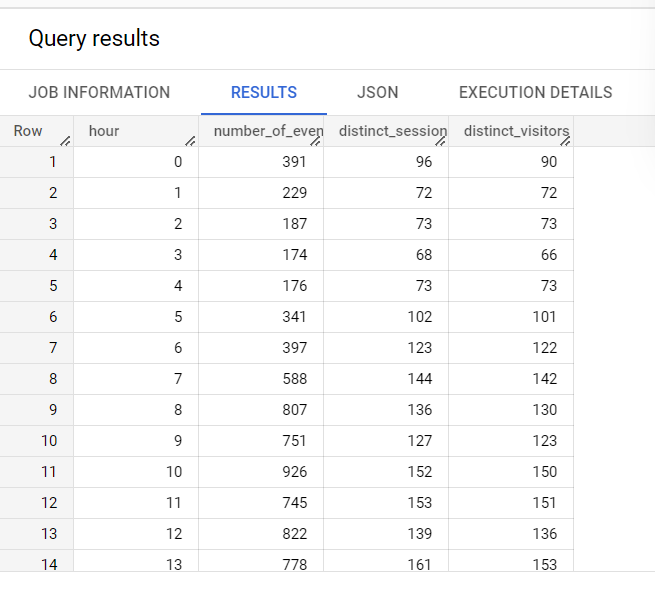
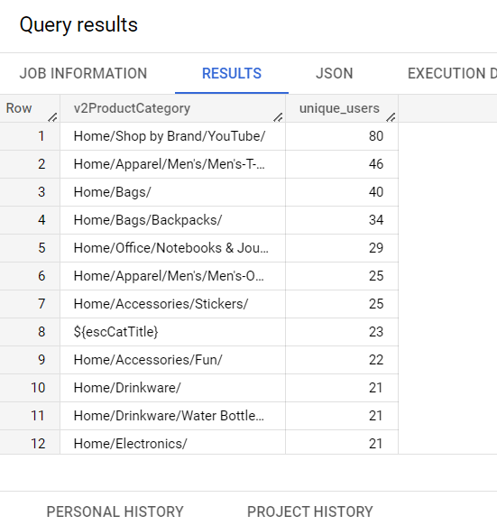
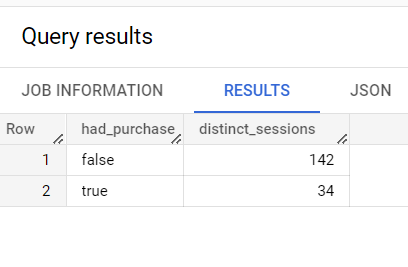

# google-analytics-case-study

## Question 1
What were the number of events, unique sessions, and unique users (i.e., full visitors) that occurred in each hour? By “hour” let's assume we mean the hour in which the event occurred.

```sql
SELECT 
  hits.hour
  ,COUNT(*) as number_of_events
  ,COUNT(DISTINCT CONCAT(fullVisitorId, visitId)) as distinct_sessions
  ,COUNT(DISTINCT fullVisitorId) as distinct_visitors
FROM `bigquery-public-data.google_analytics_sample.ga_sessions_20170801` 
,UNNEST(hits) AS hits
GROUP BY hits.hour
ORDER BY 1;
```
Using crossjoin on UNNEST(hits) in order to get one row per hit to calculate number of hits.



## Question 2
Each event or hit may be associated with nested product-related fields, found in hits.product. Let's suppose we want to know the top product categories (indicated by product.v2ProductCategory) with respect to the total number of unique users who either performed a “Quickview Click”, “Product Click”, or “Promotion Click” action (as indicated by hits.eventInfo.eventAction). We also want to make sure we're analyzing true user-actions (see hits.type) and not page views.


```sql
SELECT 
	product.v2ProductCategory
	,COUNT(DISTINCT fullVisitorId) as unique_users
FROM `bigquery-public-data.google_analytics_sample.ga_sessions_20170801` 
,UNNEST(hits) as hits
,UNNEST(hits.product) as product
WHERE hits.type != 'PAGE'
AND hits.eventInfo.eventAction IN ('Quickview Click', 'Product Click', 'Promotion Click')
GROUP BY 1
ORDER BY 2 DESC;
```
Using crossjoin on UNNEST(hits) and UNNEST(hits.product) in order to get one row per product hit, filtering the result set to be of type and actions of interest. Returning the categories in order of having the greatest number of unique users



## Question 3
Let's suppose that we ultimately want to build a model that predicts if a session that contains an “Add to Cart” action/event will be abandoned or conclude in a successful purchase. Again, we want to use hits.eventInfo.eventAction to find “Add to Cart” actions. Assuming that a session with least one transaction (indicated by totals.transactions > 0) means the session had a purchase, write a query that summarizes the number of sessions with cart additions broken out by those with and without purchases.

```sql
SELECT 
	COALESCE(totals.transactions, 0) > 0 had_purchase
	,COUNT(DISTINCT CONCAT(fullVisitorId, visitId)) as distinct_sessions
FROM `bigquery-public-data.google_analytics_sample.ga_sessions_20170801`
,UNNEST(hits) AS hits
WHERE hits.eventInfo.eventAction = 'Add to Cart'
GROUP BY 1;
```
Filtering to "Add to Cart" actions and grouping by boolean defined by whether or not there was a purchase.



## Question 4
Now, knowing how to determine sessions with purchases vs. sessions with abandoned carts, let's wrap this up by building a data set that we think contains useful features for a model that predicts if a session will ultimately end up with an abandoned cart or a successful purchase. In this case, feel free to explore the data and add any data you think might be meaningful. You should expand your final data set to pull from bigquery-public-data.google_analytics_sample.ga_sessions*, giving you more data to work with. Please provide a brief write up of the additional columns/features you've chosen and why you think they matter.

```sql
WITH SESSIONS_OF_INTEREST AS (
  -- sessions with add to cart event
    SELECT 
    visitId
    ,fullVisitorId
    ,visitNumber
    ,COUNT(DISTINCT product.v2ProductName) as distinct_products_added_to_cart
    ,COUNT(*) as add_to_cart_events
    ,MIN(hits.time) as seconds_to_add_to_cart
  FROM `bigquery-public-data.google_analytics_sample.ga_sessions_*`
  ,UNNEST(hits) AS hits
  ,UNNEST(hits.product) AS product
  WHERE hits.eventInfo.eventAction = 'Add to Cart'
  GROUP BY 1,2,3
),

HISTORICAL_USER_FEATURES AS (
  SELECT
    a.fullVisitorId
    ,COALESCE(MAX(b.totals.transactions), 0) as has_purchased_before
    ,MAX(b.visitStartTime) as last_session_start_time
  FROM SESSIONS_OF_INTEREST as a
  LEFT JOIN `bigquery-public-data.google_analytics_sample.ga_sessions_*` as b
    ON a.fullVisitorId = b.fullVisitorId
    -- ensure we are not including 'future' data
    AND a.visitNumber > COALESCE(b.visitNumber,1)
  GROUP BY 1
)

SELECT
    COALESCE(c.totals.transactions, 0) > 0 had_purchase -- target
    ,a.visitId
    ,a.fullVisitorId
    -- engagement features
    ,a.visitNumber
    ,a.distinct_products_added_to_cart
    ,a. add_to_cart_events
    ,a.seconds_to_add_to_cart
    ,c.totals.sessionQualityDim
    ,c.totals.timeOnSite
    ,c.totals.pageviews
    ,c.socialEngagementType
    -- intention features
    ,c.trafficSource.isTrueDirect
    ,c.trafficSource.medium
    ,c.device.deviceCategory
    -- customer information
    ,c.geoNetwork.country = 'United States' as is_domestic
    -- historical
    ,b.has_purchased_before
    ,c.visitStartTime - b.last_session_start_time as time_since_last_session
FROM SESSIONS_OF_INTEREST as a
LEFT JOIN HISTORICAL_USER_FEATURES as b
  ON a.fullVisitorId = b.fullVisitorId
-- total features
LEFT JOIN `bigquery-public-data.google_analytics_sample.ga_sessions_*` as c
  ON a.visitId = c.visitId
  AND a.fullVisitorId = c.fullVisitorId;
```

We need a dataset on the grain of session for all sessions which have added a product to cart.
Since the model's target variable will be whether or not the session converts to a purchase we will include boolean of had_purchase.
The features I've chosen for this model can be broken down into the following categories:
- **Features measuring engagement**: (number of add to cart events, distinct products viewed, time elapsed since session start to first add to cart, total time on site, total page views, visit number, session quality, social engagement). These features indicate how involved the user was with the site. Someone who spends more time engaging could potentially be more likely to purchase.
- **Features measuring intention**: (is true direct, source medium) These features may indicate how serious/intent a user is in making a purchase. For example, if the user is specifically searching for the product they may be more likely to convert than a user who indirectly landed there due to an add.
- **Customer information**: (is domestic) Assuming that the company is based in the US, a user's geographical location could determine how likely they are to go through with a purchase. For example, if the user is not domestic there could be additional fees such as higher shipping, taxes, tarrifs, longer lead time, etc. which could result in a user being less likely to go through with a purchase.
- **Historical behavior** (has purchased before, time since last session) A user's historical behavior may be a good indicator of if they will complete a purchase. For example, if the user has purchased before they may be more likely to purchase again. Also the recency of a user's last session could show that the user has contemplated and is now ready to complete a purchase.

The features above are just a sample of features which could be relevant. Additional features that could be considered given more time would be examining site performance (did the user run into high latency or any errors?), traversal of events (did the user keep visiting particular pages or go through a particular user flow which could indicate purchase likelihood?), was there a promotion at the time of the session?, along with any other datasources we may have around the user.
